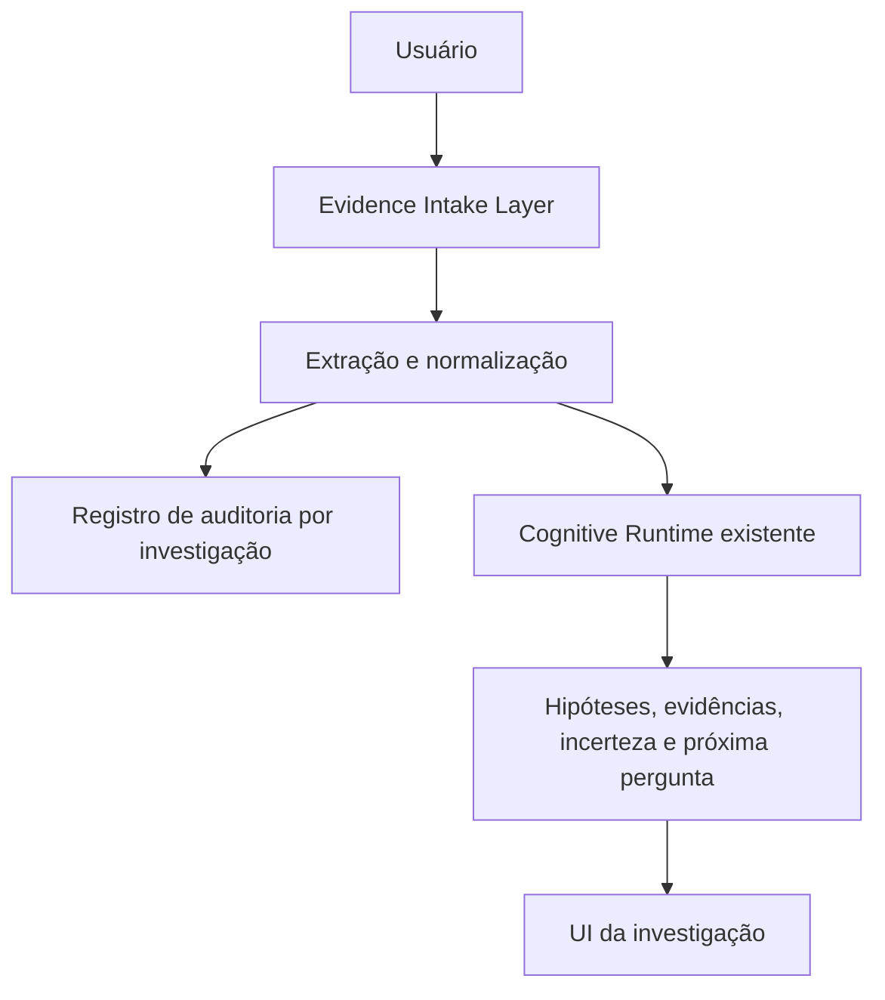

# ATLAZ Sprint P0 - Evidence Intake Layer

## Resumo executivo

A Sprint P0 introduz a aquisição contínua de evidências durante uma investigação ativa. O usuário pode anexar múltiplos arquivos sem reiniciar o caso, e cada anexo recebe metadados, estado de processamento e vínculo explícito com `investigationId`.

## Arquitetura

`lib/evidenceIntake.ts` é a camada de aquisição. Ela valida a capacidade de extração local, normaliza texto e CSV, identifica fatos, medições, datas, entidades e eventos, e persiste uma trilha de auditoria em `sessionStorage`.

O Runtime Cognitivo não foi alterado. A integração entrega a narrativa estruturada à interface pública `AdaptiveInvestigationEngine.registerAnswer`. Somente essa chamada existente cria itens no registro de evidência, reavalia hipóteses, recalcula incerteza e seleciona a próxima pergunta. A camada de intake não altera hipóteses, confiança, decisões ou regras de governança.

## Suporte de formatos

- Extração local disponível: TXT, CSV, LOG, MD, JSON e XML.
- PDF, DOC/DOCX, XLS/XLSX e imagens são aceitos e associados ao caso, mas ficam como `needs-review` porque o projeto não possui parser instalado para esses formatos.
- Nenhuma dependência foi adicionada para simular extração de binários.

## UX e continuidade

O componente `EvidenceIntakeControl` aparece dentro de `InvestigationPageFrame`, portanto está disponível nas telas de contexto, investigação e compreensão. A interface mostra uma ação discreta, contagem de evidências e detalhes apenas quando solicitados. O estado da investigação é gravado após cada upload; anexos múltiplos usam o estado resultante do upload anterior.

## Audit trail

Cada registro contém nome, tipo MIME, tamanho, data de adição, data de processamento, estado, investigação associada, conteúdo extraído, atributos estruturados, ids de evidência criados pelo Runtime e impacto da incorporação.